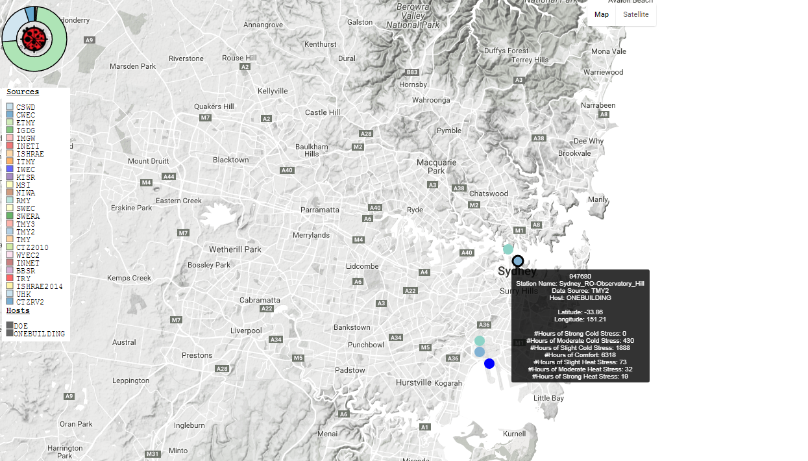
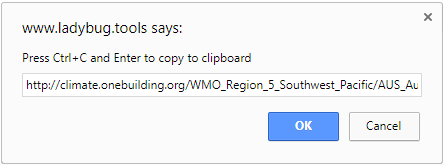
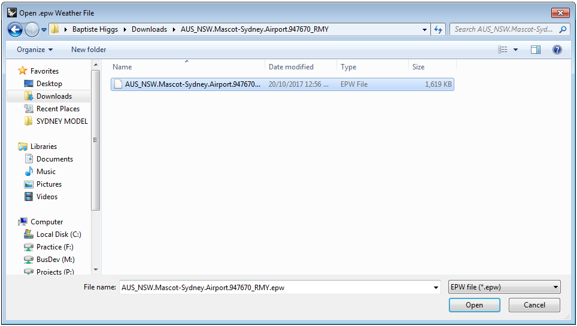
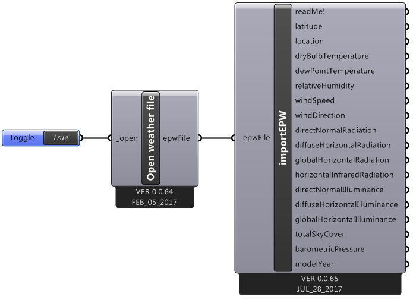
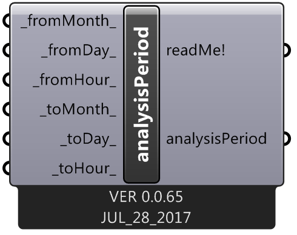
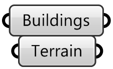
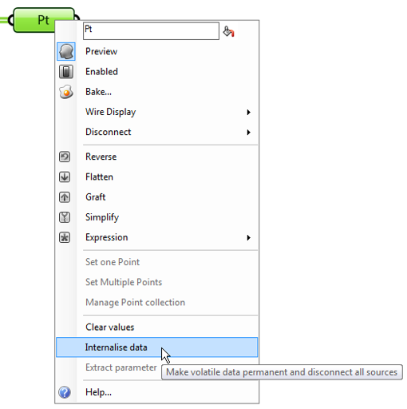
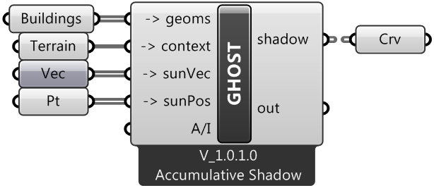

# Shadow Analysis - Wild Animals Plugin

## Issues

1. Why do a shadow analysis?

2. What does the plugin do?

3. Mesh vs Polysurface

4. Working with the analysisPeriod component

### Why do a shadow analysis?

There are a few reasons as too why a shadow analysis might be a good idea. One of the main considerations is legality, especially when designing residential apartments. The NSW government's department of planning in 2015 enacted SEPP 65 (State Environmental Planning Policy No. 65), which includes regulations on minimum sunlight access to apartments. The design criteria set out in the policy includes 3 points:

1. *Living rooms and private open spaces of at least 70% of apartments in a building receive a minimum of 2hours direct sunlight between 9am and 3pm at mid-winter in the Sydney Metropolitan Area and in the Newcastle and Wollongong local government areas.*

2. *In all other areas, living rooms and private open spaces of at least 70% of apartments in a building receive a minimum of 3 hours direct sunlight between 9am and 3pm at mid winter.*

3. *A maximum of 15% of apartments in a building receive no direct sunlight between 9am and 3pm at mid winter*

[(Source)](http://www.planning.nsw.gov.au/~/media/78489D620B0C478DA6F0F75267226E43.ashx)

In these points, direct sunlight is defined as *"a minimum of 1m2 of direct sunlight, measured at 1m above floor level, is achieved for at least 15 minutes"*. With this in place, it's necessary to perform solar analysis.

Other than legalities, the reasoning behind the policy being in place is that more sunlight access leads to a greater quality of life, which in itself is a good reason to perform a shadow analysis. [Many studies](https://www.ncbi.nlm.nih.gov/pmc/articles/PMC2728098/) [have shown](https://www.adv-sci-res.net/6/281/2011/asr-6-281-2011.pdf) [that sunlight](https://www.ncbi.nlm.nih.gov/pmc/articles/PMC2290997/) [can help with](https://dspace.lboro.ac.uk/dspace-jspui/bitstream/2134/6576/1/Joarder-et-al%5B1%5D.pdf) [mental health issues](https://deepblue.lib.umich.edu/bitstream/handle/2027.42/73377/j.1467-9280.2005.01602.x.pdf;sequence=1) [and](http://iicbe.org/upload/4635AE0416104.pdf) [generally improve](http://www.larspenke.eu/pdfs/Denissen_Butalid_Penke_van_Aken_2008_-_Weather_and_mood.pdf) [quality of life](https://phoenixprojectfoundation.us/uploads/BioLight-Sunlight___Infection_Control.pdf).

### <a name="ghostFunctions">What does the plugin do?</a>

The plugin takes 5 inputs, and has 1 output (the 'out' output is temporary and currently used for development). Here's an explanation of how to use them and what they do:

#### Inputs:

 - **Geoms.**
 
   Short for geometry, the geoms input takes the buildings and structures that are going to be analysed for their shadow's impact. These can either meshes or polysurfaces, although it is worth considering which to use, [as is discussed here](#meshpoly).

 - **Context.**
 
   The context input takes the terrain that the buildings are on (and that the shadows will be projected on to). This can also either be a mesh or a polysurface.

 - **sunVec.**
 
   Short for Sun Vector(s), these represent the direction that the sun's light shines given its position. These are generated by the *sunPath* ladybug component - go to the [ladybug section in the standard workflow part of this document](#ladybug) to see how to do this.

 - **sunPos.**
 
   Short for Sun Position(s), these represent the position that the sun is in at each time of the day to be calculated. These are also generated by the *sunPath* ladybug component.

 - **A/I.**
 
   Short for ?? , this controls whether the shadows produced are seperated per building or not. This can be controlled by connecting a boolean toggle, where *True* means that the building's shadows are connected, and *False* means that each building is seperate.

#### Outputs:
 
 - **Shadow.**
 
   These are the shadows generated by the building(s) entered on the given terrain in the form of polyline curve(s). They follow the terrain, so unless the terrain is completely flat, these won't be planar.

### <a name="meshpoly">Mesh vs Polysurface</a>

Mesh = easier for the computer; polysurface = easier for the user

### <a name="analysisPeriod">Working with the analysisPeriod component</a>

Although the inputs of *analysisPeriod* and its function seem quite intuitive, there are some things that should be noted:

 - The analysis does not include the 'to' hour. For example, if 'from' was 11am on the 3rd of December, 'to' was 2pm on the 3rd of December, and '\_timestep_' was set to 2, the times calculated would be 11am, 11:30am, 12pm, 12:30pm, 1pm, and 1:30pm (all on the 3rd of December).
    
 - The '\_fromMonth_', '\_fromDay_', '\_toMonth_', and '\_toDay_' inputs likely work the same as what you would expect, with the dates being generated inlcuding every day between the from and the to dates, including those dates. For example, if the from date was the 2nd of November and the to date was the 4th of December, the dates generated would be 2/11, 3/11, 4/11, 5/11, 6/11, ..., 30/11, 1/12, 2/12, 3/12, 4/12.
    
 - The same logic doesn't apply to the '\_fromHour_' and '\_toHour_' outputs however. Instead, these restrictions are applied to every day specified by the other inputs. For example, if 'from' was set to 4pm on the 14th of November, 'to' was set to 6pm on the 15th of November, and '\_timestep_' was set to 1, the calculated times would be 4pm on 14/11, 5pm on 14/11, 4pm on 15/11, and 5pm on 15/11.
    
 - Analysis can't happen between one day and the next. If one time is "before" another, the *analysisPeriod* component will automatically swap the two times, throwing up a warning message explaining that ladybug can't do that yet. For example, if the 'from' time was set to 8am, the 'to' time to 5am, and '\_timestep_' to 2, the times generated would be 5am, 5:30am, 6am, 6:30am, 7am, and 7:30am.
    
 - The format exported by *analysisPeriod* is a pair of tuples, one to describe the 'from' time and the next to describe the 'to' time. The format of these tuples is in reverse-significance order (month, day, hour). 

## Standard Workflow

1. **File preparation**

2. **File Downloads**

3. **Ladybug Setup**

4. **GHOST Component**

Necessary plugins: Wild Animals, Ladybug

### File Preparation

1. Use **File > Worksession > Attach** to attach the building files that will be analysed for their shadow's impact. Do the same thing for the terrain files.

2. Create new layers for the building(s) and the terrain respectively, copying the models over into these layers.

3. Ensure that your models are meshes. [Here is some discussion as to whether meshes or polysurfaces are more appropriate](#meshpoly)

3. Use MeshSlice on the buildings, using the terrain as the cutting object. This ensures that there aren't any 'negative' shadows generated by sections of the buildings underneath the ground.

4. Delete the sections of the buildings that are underneath the ground after having sliced them.

5. Use ReduceMesh on the remaining parts of the buildings. **What settings to use???**

### File Downloads

1. To get the relevant EPW (**E**nergy**P**lus **W**eather) files that ladybug requires, we'll need to visit [this website](http://www.ladybug.tools/epwmap/).

2. After navigating to the relevant location, right click on the nearest circle. This will bring up a pop up with a url, copy it to the clipboard as it tells you to.

3. Go to the URL and download the zip folder. This contains the EPW file that ladybug will need.

4. Unzip the folder to access the files.

### <a name="ladybug">Ladybug Setup</a> 

1. In order to determine the shadows, we'll need data on the sun and it's location, which will be provided by ladybug. Assuming that you already have Ladybug installed (link to the install is [here](http://www.food4rhino.com/app/ladybug-tools)), open up the grasshopper file that you'll be using.

2. Create the *Ladybug_Ladybug* component. This component doesn't need to be connected to anything, but just initialises some classes that other components need to run.

3. Create the *open weather file* component, and attach a boolean toggle to it.

4. Double click the boolean toggle - this should open up a window that will let you pick a file. Select the EPW file we downloaded earlier.

5. Create the *importEPW* component, and connect it to the ouput of *open weather file*. This component just extrapolates all the data from the EPW file and provides a series of outputs for use with other ladybug components.

6. Create the *sunPath* component, connecting the 'location' output of the *importEPW* component to *sunPath*'s '\_location' input. The sunPath component generates a lot of different data about the sun, some of which will be used with the GHOST component to do the shadow analysis.

7. The default time that ladyBug chooses is midday on the 21st of December. However, these can be changed quite easily by modifying the '\_hour_', '\_day_' and '\_month_' inputs to their respective integers. The '\_timestep_' input determines how many shadows are calculated per hour, and should be a factor of 60.

8. To analyse a longer period of time than one hour, you can use the *analysisPeriod* component. Connect the 'analysisPeriod' output on the component to the 'analysisPeriod_' input on the sunPath component to use it.

   *Note: This will override the '\_hour_', '\_day_', and '\_month_' inputs (but not the '\_timestep_' input)*
   

9. The inputs for analysis period are fairly straightforward, each being an integer representing the hour, day or month of either the start date of the analysis period or the end date.

   *Note: There are some technicalities as to how the *analysisPeriod* component works, [see here](#analysisPeriod) for details.

10. Everything should be set up now for the GHOST component!

### GHOST Component

1. Open up grasshopper, importing the buildings and the terrain.

2. Going back to the *sunPath* component, connect the output to a *point* component.

3. Right click on the *point* component, and select 'Internalise Data'. This ensures that if the previous components are changed in any way, it won't affect the shadow analysis script (which can be quite computationally expensive!). 

4. Repeat steps 2 & 3, except with the 'sunVectors' output, and the *vector* component.

5. Connect the building meshes to 'geoms', the terrain meshes to 'context', the sun vectors to 'sunVec', and the sun's positions to 'sunPos'. This will likely take a decent amount of time load, depending on how beefy your computer is and how many buildings and points you've asked it to render from. See [here](#ghostFunctions) for a deeper explanation of the different inputs and outputs of the GHOST component.

6. The curves exported are now finished and ready for solar analysis!

