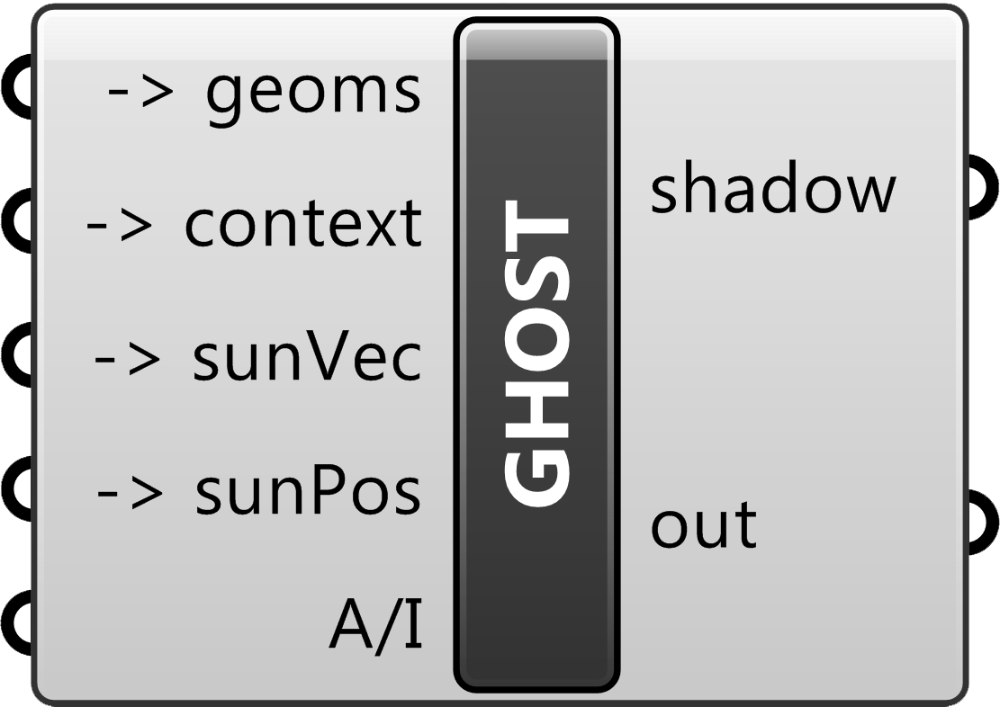

# Shadow Analysis - Wild Animals Plugin

### Why do a shadow analysis?

sdgasfdgadfhadgh

### What does the plugin do?

The plugin takes 5 inputs, and has 1 output (the 'out' output is temporary and currently used for development). Here's an explanation of how to use them and what they do:

#### Inputs:

 - **Geoms.**
 
   Short for geometry, the geoms input takes the buildings and structures that are going to be analysed for their shadow's impact. These can either meshes or polysurfaces, although it is worth considering which to use, [as is discussed here](#meshpoly).

 - **Context.**
 
   The context input takes the terrain that the buildings are on (and that the shadows will be projected on to). This can also either be a mesh or a polysurface.

 - **sunVec.**
 
   Short for Sun Vector(s), *what are these??? how are they generated (with ladybug, but how)?*

 - **sunPos.**
 
   Short for Sun Position(s), *what are these??? how are they generated (with ladybug, but how)?*

 - **A/I.**
 
   Short for ?? , this controls whether the shadows produced are seperated per building or not. This can be controlled by connecting a boolean toggle, where *True* means that the building's shadows are connected, and *False* means that each building is seperate.
   

### <a name="meshpoly">Mesh vs Polysurface</a>

Mesh = easier for the computer; polysurface = easier for the user

### Ladybug

### Standard Workflow

Necessary plugins: GHOST, Ladybug

1. **File > Worksession > Attach** building files

2. **File > Worksession > Attach** terrain files

3. Copy the building and terrain files into their own layers

4. Use MeshSlice on the buildings, using the terrain as the cutting object. This is to make sure there aren't any 'negative' shadows generated by sections of the buildings underneath the ground.

5. Delete the sections of the buildings that are underneath the ground.

6. Use ReduceMesh on the remaining parts of the buildings. **What settings to use???**

7. The buildings are now ready to be imported into grasshopper. Open up grasshopper, importing the buildings and the terrain.

8. In order to determine the shadows, we'll need data on the sun and it's location, which will be provided by ladybug. Assuming that you already have Ladybug installed, to get the relevant EPW (**E**nergy**P**lus **W**eather) files, we'll need to visit [this website](http://www.ladybug.tools/epwmap/).

9. After navigating to the relevant location, right click

